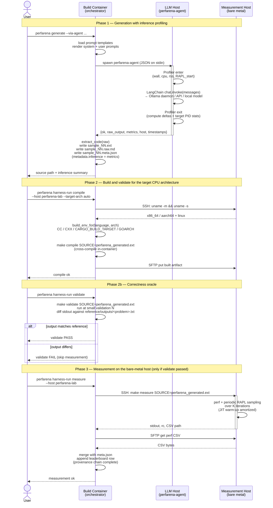

# PerfArena execution pipeline

This document shows how a single `(model, language, problem)` cell
flows through PerfArena end to end, from the moment the user asks
for a generation to the moment a row lands on the leaderboard.

Three actors:

- **Build container** — the orchestrator. Has every compiler and
  transpiler PerfArena needs, including cross-compilers for
  aarch64. Holds the CLI, the prompt templates, the configs, and
  the generation pipeline. Runs on your laptop or in CI.
- **LLM host** — an isolated machine that runs the local LLM and
  the `perfarena-agent` subprocess. May be the same physical
  machine as the build container during early development;
  intended to be separate for phase 1.
- **Measurement host** — the bare-metal reference machine. Has
  `perf`, RAPL, pinned toolchains, and a tuned OS. Never runs an
  LLM and never builds anything. All publishable numbers come from
  here.

## High-level architecture

```
 ┌───────────────┐      ┌─────────────────────┐      ┌────────────────────┐      ┌──────────────────┐
 │     User      │      │   Build Container   │      │      LLM Host      │      │ Measurement Host │
 │   (laptop)    │      │   (orchestrator)    │      │  (isolated, local) │      │   (bare metal)   │
 │               │      │                     │      │                    │      │                  │
 │  perfarena    │      │   perfarena CLI     │      │  perfarena-agent   │      │   make compile   │
 │  commands     │      │   prompt templates  │      │  Profiler          │      │   make measure   │
 │               │      │   cross-compilers   │      │  LLM (Ollama, ...) │      │   perf / RAPL    │
 │               │      │   LangChain clients │      │  psutil / RAPL     │      │   pinned runtime │
 └───────┬───────┘      └──────────┬──────────┘      └─────────┬──────────┘      └────────┬─────────┘
         │                         │                           │                          │
         │   CLI invocation        │                           │                          │
         │────────────────────────>│                           │                          │
         │                         │                           │                          │
         │                         │   spawn agent (JSON)      │                          │
         │                         │──────────────────────────>│                          │
         │                         │                           │  wrap LLM call in        │
         │                         │                           │  Profiler                │
         │                         │   {text, metrics}         │                          │
         │                         │<──────────────────────────│                          │
         │                         │                           │                          │
         │                         │   probe arch via SSH                                 │
         │                         │─────────────────────────────────────────────────────>│
         │                         │   arch                                               │
         │                         │<─────────────────────────────────────────────────────│
         │                         │                                                      │
         │                         │   cross-compile locally                              │
         │                         │                                                      │
         │                         │   SFTP built artifact                                │
         │                         │─────────────────────────────────────────────────────>│
         │                         │                                                      │
         │                         │   SSH: make measure                                  │
         │                         │─────────────────────────────────────────────────────>│
         │                         │                           │   perf + RAPL across K   │
         │                         │                           │   iterations             │
         │                         │   CSV + stdout                                       │
         │                         │<─────────────────────────────────────────────────────│
         │                         │                                                      │
         │   source + meta.json    │                                                      │
         │<────────────────────────│                                                      │
```

## Sequence diagram (mermaid)



## What flows between the stages

| Step                           | Produced by       | Consumed by       | Artifact                                               |
|--------------------------------|-------------------|-------------------|--------------------------------------------------------|
| CLI invocation                 | User              | Build container   | command-line arguments                                 |
| Rendered prompts               | Build container   | Build container   | `{system_text, user_text}` in memory                   |
| Agent request                  | Build container   | LLM host          | JSON on stdin (provider, model, prompts, sampling)     |
| LLM response + metrics         | LLM host          | Build container   | JSON on stdout (`raw_output`, `metrics`, `host`)       |
| Source file                    | Build container   | filesystem        | `sample_NN.<ext>`                                      |
| Raw response sidecar           | Build container   | filesystem        | `sample_NN.<ext>.raw.md`                               |
| Per-row metadata sidecar       | Build container   | filesystem        | `sample_NN.<ext>.meta.json` (generation + inference)   |
| Arch probe                     | Measurement host  | Build container   | `uname -m` / `uname -s` output                         |
| Cross-compiled artifact        | Build container   | Measurement host  | ELF binary (for C++/Rust/Go) or source (interpreted)   |
| Validation result              | Build container   | Build container   | PASS or FAIL (stdout diffed against reference output)   |
| Measurement request            | Build container   | Measurement host  | `make measure` invocation over SSH (only if validated)  |
| Measurement trace              | Measurement host  | Build container   | CSV with per-iteration runtime, RAPL, memory samples   |
| Leaderboard row                | Build container   | dataset + HF UI   | Parquet row joining generation provenance + trace      |

## Provenance chain

Every leaderboard row can be traced back through this chain:

```
leaderboard row
    └── measurement trace (measurement host, JSONL)
            └── validation result (PASS required)
            └── built artifact (build container, ELF or source)
                    └── toolchain fingerprint (/etc/perfarena-versions)
                    └── target arch (probed or explicit)
                    └── generation meta.json
                            ├── system prompt SHA-256
                            ├── user prompt SHA-256
                            ├── LLM sampling parameters (T, top-p, top-k, seed, max_tokens)
                            ├── provider + dated model version
                            └── inference metrics (wall, cpu, rss, RAPL)
                                    └── host fingerprint (uname, RAPL availability)
```

Nothing on the leaderboard is a single number without that chain
under it. This is the "per-row provenance discipline" from
Section 4 item 11 of the proposal.

## Current state vs intended state

Everything in Phase 1 (generation via the agent) is implemented
and works end to end for any of the four supported providers.

Phase 2 (compile with target-arch selection) is implemented at the
harness level: `harness-run compile` resolves the target arch, sets
the right build environment variables, and runs `make compile` with
a `SOURCE=perfarena_generated.<ext>` override when LLM-generated
code has been staged. The harness supports a split-executor mode
where `compile` and `validate` run locally (build_executor) and
`run` / `measure` / `mem` run on the remote host (run_executor),
with automatic SFTP staging of built artifacts between them.

Phase 2b (correctness oracle) is implemented and wired into the
pipeline. The `validate` Makefile target runs the benchmark at a
small validation N and diffs stdout against a reference output
stored in `reference/outputs/<problem>.txt`. Three stdin-input
problems (k-nucleotide, regex-redux, reverse-complement) get
their input piped automatically via the `STDIN_FILE` variable in
the Makefile. The `compile_validate_then_measure` convenience
method on the harness runs all three steps in sequence and stops
if validation fails.

All 101 per-benchmark Makefiles for the 10 target languages have
been patched to use `perfarena.mk` and to include the validation
metadata (VALIDATION_N, REFERENCE_OUTPUT, STDIN_FILE where needed,
BINARY_OUTPUT for mandelbrot).

Phase 3 (measurement on the bare-metal host) uses
`RAPL/perfarena_runner`, a new C tool that samples at 10 Hz with
an idle baseline, warm-up/measurement split, and JSONL output. The
original `RAPL/main` is preserved for 2017-replication runs.
